# 🏎️ AutoStore — Enterprise Car Dealership Inventory System

A full-stack modern automotive marketplace built strictly with Test-Driven Development (TDD) methodology.

**Node.js • React • MongoDB • Express • Tailwind CSS • TDD**

[]()
[]()
[]()

---

## 🏗️ System Architecture & Data Flow

AutoStore utilizes a robust **MERN stack** (MongoDB, Express, React, Node.js) separated into strict logical layers, adhering to SOLID principles. The backend isolates routing from business logic (services), ensuring high testability and maintainability.

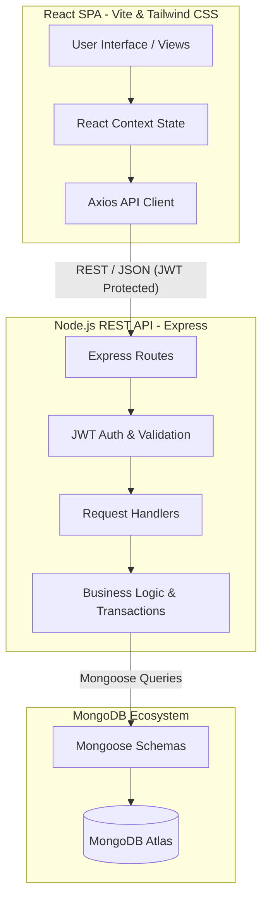

---

## 💻 Technology Stack

### Backend API
| Layer | Technology |
| :--- | :--- |
| **Runtime / Framework** | Node.js with Express 5 |
| **Database** | MongoDB (Local or Atlas) |
| **ORM / Schemas** | Mongoose (Strict validation, virtuals, indexes) |
| **Authentication** | Stateless JWT (JSON Web Tokens) + bcryptjs hashing |
| **Security & Validation** | CORS, Zod schema validation, Role-Based Access Control |
| **Testing Engine** | Jest + Supertest + mongodb-memory-server |
| **File Handling** | Multer for image processing |

### Frontend Client
| Layer | Technology |
| :--- | :--- |
| **Framework / Build Tool** | React 18 bootstrapped with Vite |
| **Styling & UI** | Tailwind CSS v4, Glassmorphism elements, Lucide React Icons |
| **State & Routing** | React Router DOM v6, modular React Contexts (Auth) |
| **Forms** | React Hook Form paired with Zod |
| **Testing Engine** | Vitest + React Testing Library |

---

## ✨ Core Features & Implementation Details

### 🛡️ Authentication & Authorization
- **Role-Based Access Control (RBAC):** Distinct privileges for `user` (customers) and `admin` (dealership managers).
- **Secure Sessions:** Encrypted passwords via bcrypt, JWT tokens stored securely.
- **Protected Routes:** Admin-only endpoints guarded by backend middleware (`requireAdmin`) and frontend conditional rendering.

### 🚗 Vehicle & Inventory Management
- **Full CRUD Lifecycle:** Admins can effortlessly create, read, update, and delete vehicles from the fleet.
- **Atomic Concurrency Checks:** Purchasing a vehicle uses atomic operations to safely decrement stock (`$inc`) preventing overselling/race conditions.
- **Dynamic Restocking:** Admin panel allows one-click inventory restocking.
- **Featured Selection:** Mark specific cars as "Featured" to promote them directly on the Customer Dashboard hero section.

### 🔍 Advanced Search & Discovery Engine
- **Algorithmic Filtering:** Real-time search by Make, Model, Body Category (Sedan, SUV, Coupe, etc.), and dynamic Price Range sliders.
- **Pagination & Optimization:** Backend pagination and indexed database queries for ultra-fast load times.
- **Recommendation Engine:** "Similar Cars" algorithm automatically displays highly relevant alternatives on vehicle detail pages.
- **Vehicle Comparison:** Side-by-side spec comparison tool for prospective buyers.

### 💼 Admin CRM & Dealership Dashboards
- **Orders Ledger:** A comprehensive breakdown of all placed orders, tracking revenue and buyer contact info.
- **Test Drive Appointments:** A scheduling dashboard allowing admins to view, approve, and manage incoming test drive requests.
- **Customer Directory:** Track user engagement metrics and account creation dates across the entire platform.

---

## 📸 Application Gallery

### Admin Panel Dashboards

| Orders Placed | Test Drive Management |
| :---: | :---: |
| 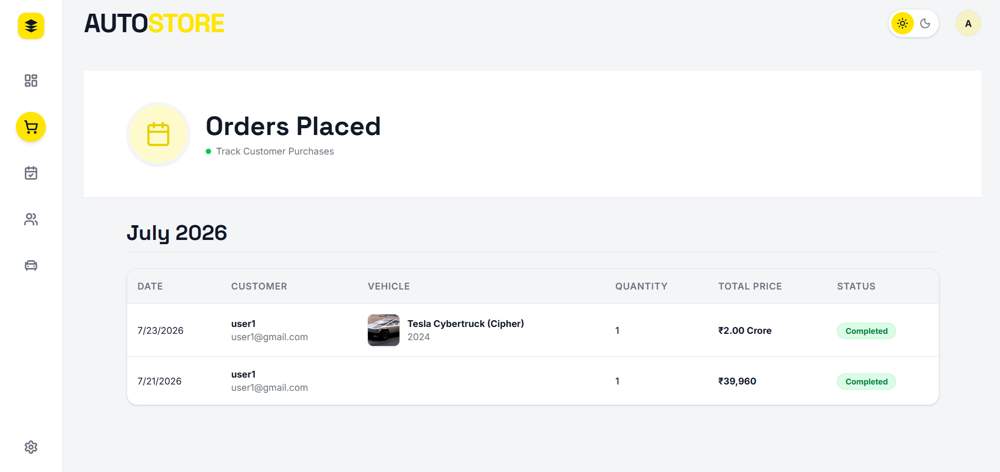 | 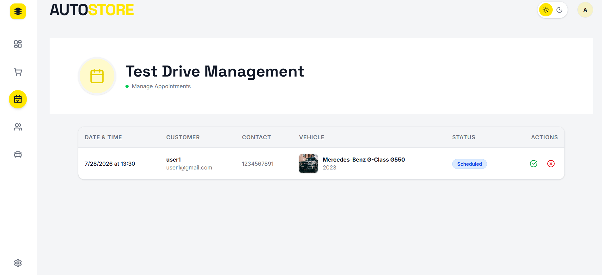 |
| **Customer Directory** | **Inventory & Featured** |
| 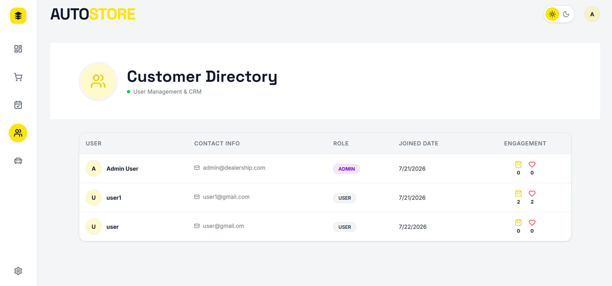 | 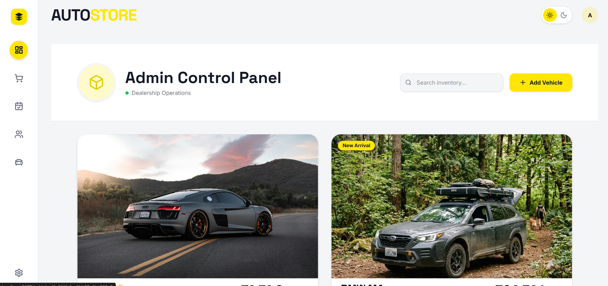 |

**Edit Vehicle Modal**  
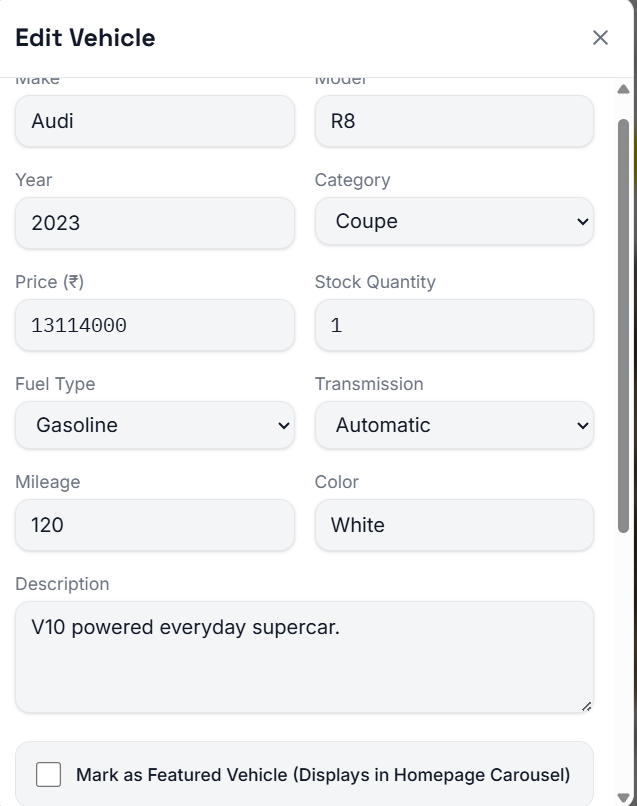

### Customer Frontend & Features

| Digital Showroom (Hero) | Advanced Search & Filters |
| :---: | :---: |
| 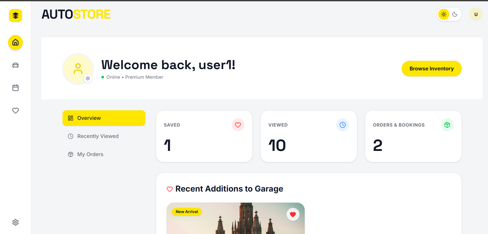 | 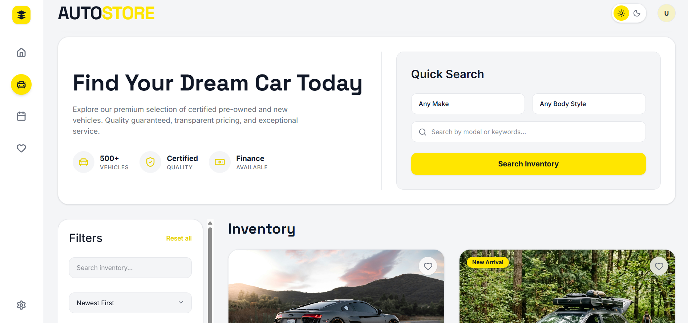 |
| **Vehicle Details** | **Similar Cars Engine** |
| 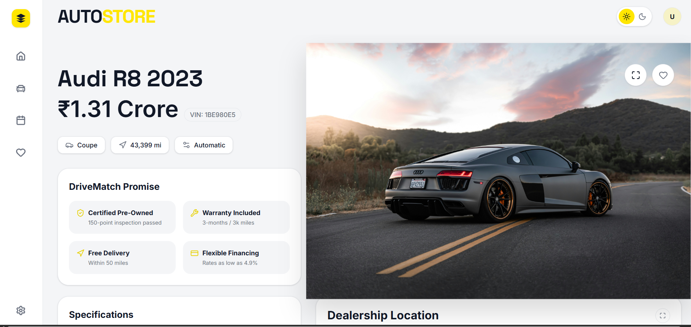 | 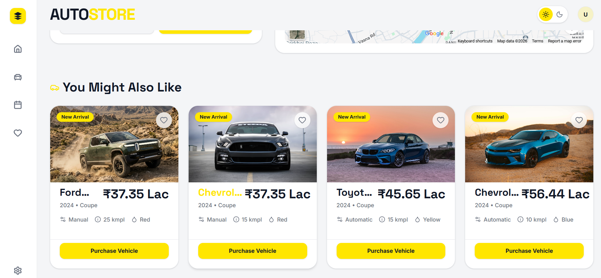 |
| **Vehicle Comparison Tool** | **Dark Theme Experience** |
| 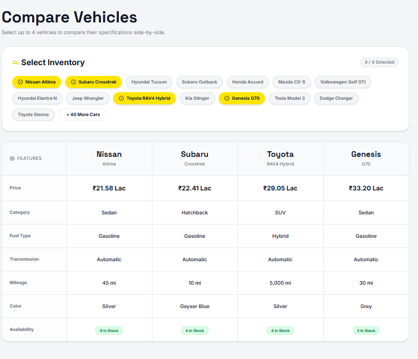 | 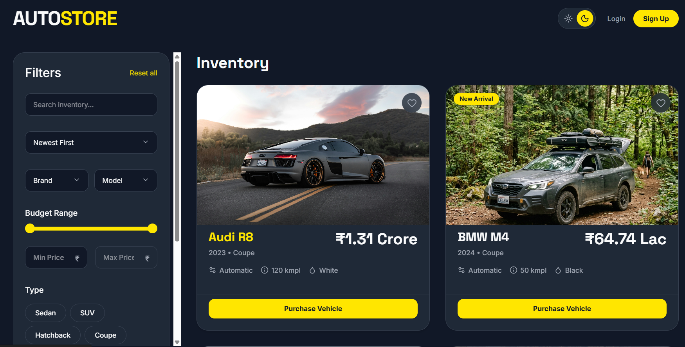 |

---

## 🚀 Getting Started

### Prerequisites
- Node.js (v18.0.0 or higher)
- MongoDB (Local instance or MongoDB Atlas cluster URI)
- Git

### 1. Clone & Install
```bash
git clone https://github.com/your-username/autostore-dealership.git
cd autostore-dealership

# Install Backend Dependencies
cd backend && npm install

# Install Frontend Dependencies
cd ../frontend && npm install
```

### 2. Configure Environment Variables
Create `backend/.env`:
```env
PORT=5000
MONGO_URI=mongodb://localhost:27017/car_dealership
JWT_SECRET=your_super_secret_jwt_key
NODE_ENV=development
```

### 3. Start Development Servers
```bash
# Terminal 1 — Boot Backend API
cd backend && npm run dev

# Terminal 2 — Boot Frontend Client
cd frontend && npm run dev
```
Open `http://localhost:5173` in your browser.

---

## 🔑 Default Seed Credentials
| Role | Email | Password |
| :--- | :--- | :--- |
| **Admin** | admin@dealership.com | password123 |
| **User**  | user1@gmail.com  | 123456 |

---

## 🧪 Test-Driven Development (TDD) Report

This project strictly adheres to the **Red-Green-Refactor** cycle. The backend isolates business logic in the `services` layer for rapid unit testing, while `mongodb-memory-server` powers robust integration testing without mutating production databases.

### Backend Testing (Jest & Supertest)
```bash
cd backend && npm test
```
**Coverage:** 52 automated tests across 11 suites.
*Tests encompass JWT authorization flows, atomic inventory decrements, test drive scheduling logic, boundary condition handling (e.g. buying 0 stock), and error handling.*

### Frontend Testing (Vitest & React Testing Library)
```bash
cd frontend && npm test
```
**Coverage:** UI component mounting, context states, and mock API data integrations.

---

## 🤖 My AI Usage (Co-Authorship)

### Tool Used
**Antigravity (Google DeepMind)** — Autonomous AI coding agent & architectural consultant.

### Methodology & Workflow
Throughout this build, I operated as the lead architect and product manager, utilizing AI as a high-velocity pair-programmer. 
- **Architecture Validation:** I supplied strict TDD constraints and SOLID principles (e.g., separating controllers from services). The AI successfully adhered to these constraints, ensuring code cleanliness.
- **Boilerplate & Test Generation:** I instructed the AI to write failing Jest tests first (`authService.test.js`, `vehicles.test.js`), then generate the minimal Express implementation to pass them.
- **UI Prototyping:** I provided design directives (Tailwind CSS v4, Glassmorphism) and the AI rapidly scaffolded responsive React components (e.g., `VehicleCard`, `FilterRail`).
- **Complex Debugging:** We collaboratively solved complex state mismatches and atomic database operation errors (e.g. fixing race conditions in concurrent purchase endpoints).

### Reflection
Integrating agentic AI fundamentally shifted the development paradigm. By outsourcing raw syntax generation and boilerplate tests, I was able to maintain a macro-level focus on system architecture, UX flow, and edge-case business logic. The strict mandate to use TDD prevented the AI from writing opaque or bloated functions, resulting in a remarkably resilient, enterprise-grade codebase built in a fraction of the traditional time.

---
**License**: MIT
